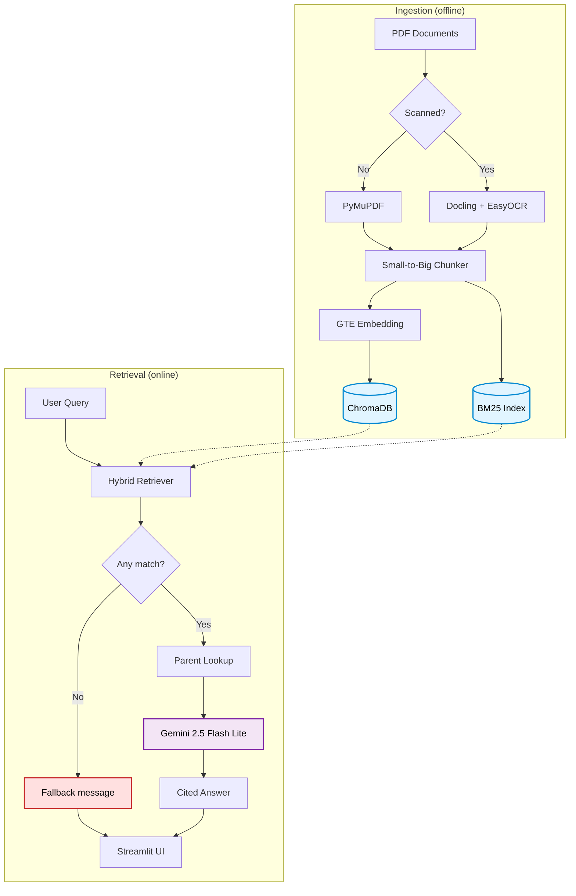

# Legal RAG Assistant
A personal end-to-end Retrieval-Augmented Generation (RAG) system that helps look up and answer legal questions. Currently focused on Vietnamese legal documents, with plans to extend to other jurisdictions.

---

## Table of Contents
* [Features](#features)
* [Architecture](#architecture)
* [Tech Stack](#tech-stack)
* [How it works](#how-it-works)
* [Project Setup](#project-setup)
* [Project Structure](#project-structure)
* [Limitations](#limitations)
* [Future implementations](#future-implementations)

---

## Features
- **Scope**: Currently covers Vietnamese law across AI, Labor, and Cybersecurity domains. More jurisdictions and domains will be added in the near future.
- **Small-to-Big retrieval**: Parent-Child chunking - matches on small chunks for precision, then returns the parent section so the LLM has full context.
- **Hybrid search**: Combines BM25 (lexical) and vector search (semantic) to catch both exact legal terminology and paraphrased queries.
- **Conversation memory**: Retains chat history so the assistant can resolve references in follow-up questions.
- **Source citations**: Every answer returns the exact quoted passage together with the source filename, so users can verify against the original document.

---

## Architecture



---

## Tech Stack
| Component          | Technology                                                  |
| ------------------ | ----------------------------------------------------------- |
| Frontend           | Streamlit                                                   |
| Framework          | LangChain                                                   |
| Embedding Model    | Alibaba-NLP/gte-multilingual-base                           |
| Reasoning LLM      | Gemini 2.5 Flash Lite                                       |
| Vector Database    | ChromaDB                                                    |
| Lexical Retriever  | BM25                                                        |
| PDF Processing     | PyMuPDF (text-based PDFs), Docling + EasyOCR (scanned PDFs) |
| Evaluation         | RAGAS                                                       |

---

## How It Works
### 1. Document ingestion
Text-based PDFs are parsed with PyMuPDF; scanned PDFs fall back to Docling + EasyOCR.
 
### 2. Small-to-Big chunking (hierarchy-driven)
Instead of fixed-size character chunks, the splitter reads the structural headers of the legal document and builds a parent-child tree based on their hierarchy. Vietnamese legal documents follow this hierarchy (from largest to smallest):

`Phần → Chương → Mục → Tiểu mục → Điều`

Not every document uses every level - some laws only have `Chương` and `Điều`, others go deeper. The splitter therefore works dynamically:

- It scans the document to find the **smallest header level actually present**, and sets that as the **child** chunk.
- The next larger header found in the document becomes the **parent**.

For example, if a law contains only `Chương` and `Điều`, then `Điều` is the child and `Chương` is the parent. If a law additionally has `Mục`, then `Điều` stays as child but `Mục` takes over as parent.

Retrieval is performed on the child (small, precise) level. When a child is matched, its parent is looked up and attached to the context so the LLM sees the broader section the child belongs to.
 
### 3. Hybrid search
Queries are run through two retrievers in parallel:
 
- **BM25** for exact legal terminology (article numbers, statute names, fixed phrasings).
- **Vector search** (GTE embeddings in ChromaDB) for semantic / paraphrased questions.
Results are fused before passing to the reader.
 
### 4. Parent reference injection
Every retrieved child chunk is enriched with a reference to its parent node. The LLM receives both the specific Article and the Chapter it lives in, plus the source filename and quoted passage for citation.
 
### 5. Answer generation
A LangChain chain feeds the fused, parent-referenced context to Gemini 2.5 Flash Lite together with the chat history, and returns a cited answer.

---

## Project Structure
```
legal-rag-assistant/
├── ./
│   ├── app.py                             # Streamlit entry point
│   ├── data/
│   │   ├── bm25/                          # Store BM25 cache 
│   │   ├── chromadb/                      # Child chunks
│   │   ├── docstore/                      # Parent chunks
│   │   ├── json_files                     # JSON files processed
│   ├── evaluation/                        
│   │   ├── evaluate_rag.py
│   │   ├── dataset/
│   │   │   ├── evaluation_dataset.json      
│   │   │   ├── validation_dataset.json
│   ├── src/
│   │   ├── prompt.py
│   │   ├── rag_engine.py                  # Main logic ingest + retrieve
│   │   ├── models/                        
│   │   │   ├── embeddings/
│   │   │   │   ├── gte_multi_base.py      # Embedding model
│   │   ├── pdf_processing/
│   │   │   ├── docling_worker.ipynb       # OCR + pdf processing in google colab
```
---

## Project Setup
### Installation
```bash
# 1. Clone
git clone https://github.com/NhatAnh1801/legal-rag-assistant.git
cd legal-rag-assistant
 
# 2. Create environment
python -m venv .venv
source .venv/bin/activate        # Windows: .venv\Scripts\activate 
 
# 3. Install dependencies
pip install -r requirements.txt
 
# 4. Configure API key in .env file
# GEMINI_API_KEY=your_gemini_key
```

### Usage
```bash
streamlit run app.py
```

Then in the UI:
1. Select the jurisdiction (currently **Vietnam**).
2. Pick a legal domain (AI Law, Labor Law, or Cybersecurity Law).
3. Ask a question in Vietnamese or English.
4. The answer is returned with citations.
---

## Limitations
- **OCR accuracy on Vietnamese**: EasyOCR has relatively low accuracy on Vietnamese diacritics and is slow (~120–130 seconds for 30 scanned pages on a T4 GPU). For larger documents (~80 pages) processing can take up to ~480 seconds.
- **GPU constraints**: My laptop (RTX 3060 6GB) cannot run the GTE embedding model and EasyOCR simultaneously, so OCR has to be offloaded to a cloud GPU.
- **API quota**: Uses the Gemini free tier (100 requests/day), which caps how many questions can be asked per day.
- **File format**: Currently PDF only.
- **Jurisdiction**: Currently Vietnamese law only.

## Future Implementations 
- **Cross-encoder reranking**: Add a reranker on top of the hybrid retriever to return the most relevant chunks to the LLM.
- **Embedding evaluation & fine-tuning**: Benchmark the current GTE model on Vietnamese legal queries and fine-tune if results justify it.
- **Finer-grained chunking**: Extend the Small-to-Big splitter below `Điều` level - use each `Khoản` as the child and the enclosing `Điều` as the parent - for higher-precision retrieval on long articles.
- **Extend to more jurisdictions**: Start with a second country (e.g. United States) once the Vietnamese pipeline is stable.
- **Evaluation framework**: Systematic evaluation of retrieval quality (hit@k, MRR) and end-to-end answer quality, with parameter tuning.
- **Broader file format support**: DOCX, HTML, scanned images beyond PDF.
- **Cloud-hosted vector store**: Migrate ChromaDB to a managed/cloud deployment.
- **OCR optimization**: Replace/augment EasyOCR with a faster, more Vietnamese-accurate engine.
